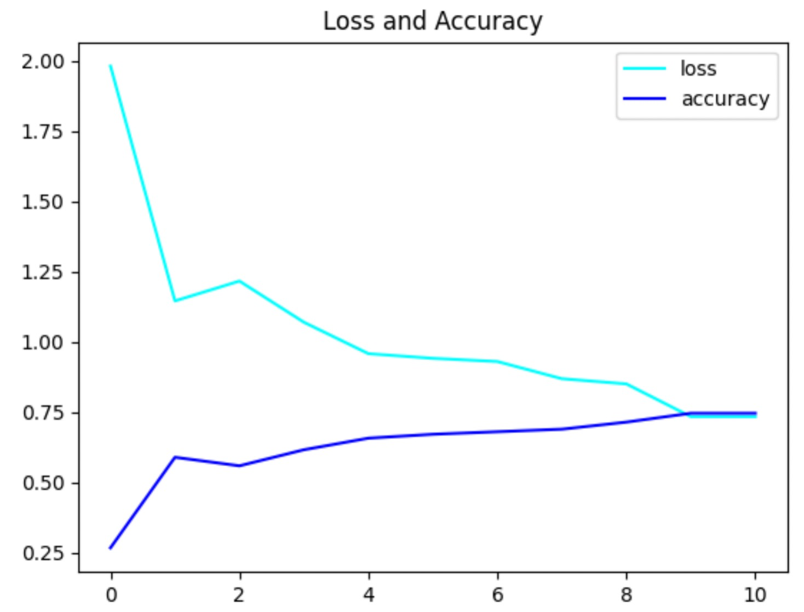
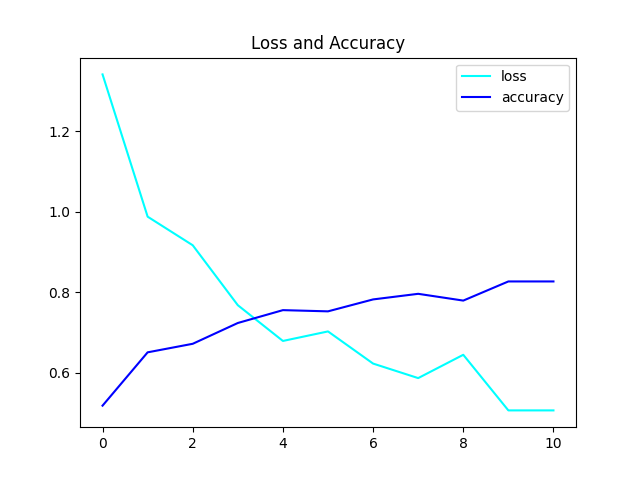
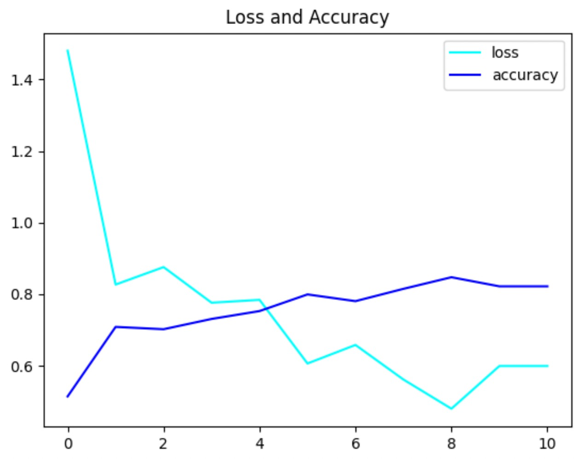
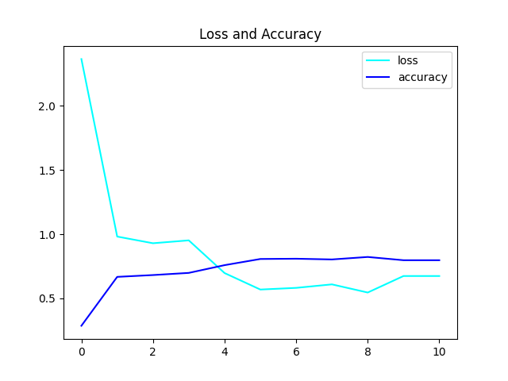
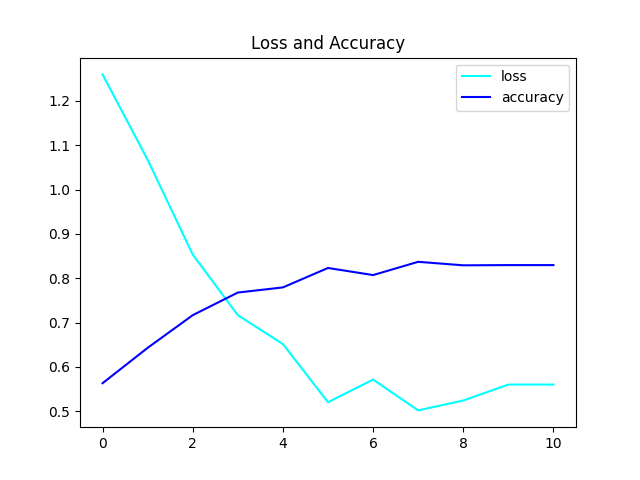
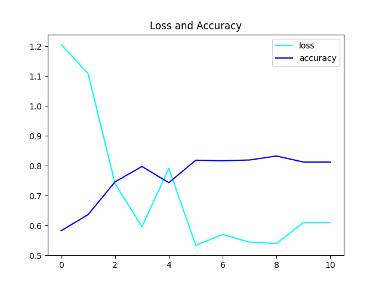

# 人工智能安全课程作业-CIFAR10图像分类

## 模型介绍

​	依托Tensorflow-Keras框架，以六层的CNN进行简单的图像分类处理，在CIFAR10数据集中进行训练，使用交叉墒作为Loss函数，使用Accuracy作为模型评估的标准。

## 运行说明

​	必备环境：

```shell
	numpy==1.16.0
	matplotlib==3.3.3
	keras==2.3.1
	TensorFlow-gpu==1.15.0	
```

​	运行`python Keras.py`即可。

## 超参数调整

#### 优化器Optimizer

##### SGD

​	随机梯度下降，每次只选择一个样本的数据来进行更新梯度。可以避免 BGD 因为大数据集而造成的冗余计算。

​	可以看到Loss容易收敛到局部最优，与下文几种优化器进行比较，可以看到最低Loss点偏高。并且在某些情况下可能被困在鞍点。




##### Adagrad

​	自适应梯度的优化器，对不同参数使用不同的学习率，对于更新频率较低的参数施以较大的学习率，对于更新频率较高的参数用以较小的学习率。

​	随着步数增加很容易越累积越大，从导致学习率过早变小，学习缓慢。



##### Adadelta

​	对Adagrad的扩展，对学习率进行自我约束，只累加固定大小的值。

​	可以看到训练前中期的加速效果不错。



##### Adam

​	泛化极好，比起其他优化器性能也更好，会对梯度、梯度的平方使用指数加权平均。




### BatchSize

​	指一次训练所选取的样本数。BatchSize的适当增大能使网络梯度更加准确。由于样本是随机选取的，满足独立同分布，所以所有样本具有相同的方差，增大BatchSIze能够减少样本的方差，因此梯度可以更加准确。

​	可以看到batchSize在更大的情况下，会更快的获得更优秀的accuracy,以及Loss下降会更快。	

```python
batchSize=32
Optimizer=Adam
```



```python
batchSize=64
Optimizer=Adam
```



